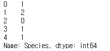

# Tensorflow tf.Data API start (1)

최근 많이 사용되고 있는 **tf.data API**에 대해 설명해보려고 합니다. 딥러닝으로 개발을 하면 데이터를 전처리하고 데이터 파이프라인을 구성하는데 더 많은 시간이 걸리는 것을 알 수 있습니다. 텐서플로우에는 다양한 데이터 전처리 및 데이터 파이프라인 모듈들이 있지만 최근 들어 많이 사용되고 있는 **tf.data API**를 사용하면 보다 쉽고 빠르게 데이터를 처리할 수 있으므로 모델 개발에 더 집중할 수 있습니다.

이 문서는 텐서플로우 공식홈페이지를 바탕으로 작성되었습니다.  
pandas, numpy에 대한 설명은 따로 드리지는 않을것이며 텐서플로우를 사용해보신 분들 이라면 쉽게 이해 하실수 있게 작성하였습니다.
pandas, numpy, tensorflow 에 대해 자세히 알고 싶으시면 아래의 내용을 참조하세요
- [Numpy 공식홈페이지](http://www.numpy.org/)
- [Pandas 공식홈페이지](https://pandas.pydata.org/)
- [Tenorflow 튜토리얼 페이지](https://www.tensorflow.org/get_started/)

---

## 아이리스 데이터셋

먼저 아이리스 데이터셋(iris dataset)을 가져오는 방법에 관해 설명하기에 앞서 아이리스 데이터셋에 대해 간략히 알아봅시다.


> 아이리스는 붓꽃을 의미합니다.

아이리스 데이터셋은 붓꽃의 특징을 저장해 놓은 데이터셋들의 모음으로서. 붓꽃의 꽃잎의 각 부분의 너비와 길이 등을 측정한 데이터셋 입니다. 총 150개의 레코드와 6개의 필드로 나타내어져 있습니다. 각 필드의 정보는 아래의 표에 자세히 설명되어있습니다.

| 필드이름 | 필드정보 |
|:-------:|:-------:|
|casenno| 일련번호 |
|Sepal Lenghth| 꽃받침의 길이 정보 |
|Sepal Width| 꽃받침의 너비 정보 |
|Sepal Length| 꽃잎의 길이 정보 |
|Sepal Width| 꽃잎의 너비 정보 |
|Species|꽃의 종류(setosa/versicolor/viginica)|

아이리스 데이터셋을 이용하면 꽃받침의 길이, 꽃받침의 너비, 꽃잎의 길이, 꽃잎의 너비 정보를 이용하여 꽃의 종류(setosa/versicolor/viginica)를 알아맞히는 모델을 만들 수가 있을 것입니다.

이제 아이리스 데이터셋을 가져와 봅시다.

```python
import numpy as np
import pandas as pd
import tensorflow as tf

TRAIN_URL = "http://download.tensorflow.org/data/iris_training.csv"
TEST_URL = "http://download.tensorflow.org/data/iris_test.csv"

CSV_COLUMN_NAMES = ['SepalLength', 'SepalWidth',
                    'PetalLength', 'PetalWidth', 'Species']
SPECIES = ['Sentosa', 'Versicolor', 'Virginica']

def maybe_download():
    """ iris dataset을 다운 받고 다운 받은 곳의 path값을 받아온다."""
    train_path = tf.keras.utils.get_file(TRAIN_URL.split('/')[-1], TRAIN_URL)
    test_path = tf.keras.utils.get_file(TEST_URL.split('/')[-1], TEST_URL)
    return train_path, test_path

def load_data(y_name='Species'):
    """Returns the iris dataset as (train_x, train_y), (test_x, test_y)."""
    train_path, test_path = maybe_download()

    train = pd.read_csv(train_path, names=CSV_COLUMN_NAMES, header=0)
    train_x, train_y = train, train.pop(y_name)

    test = pd.read_csv(test_path, names=CSV_COLUMN_NAMES, header=0)
    test_x, test_y = test, test.pop(y_name)

    return (train_x, train_y), (test_x, test_y)

(train_x, train_y), (test_x, test_y) = load_data()
print(np.shape(train_x))    # 결과 : (120, 4)
print(np.shape(train_y))    # 결과 : (120, )
print(np.shape(test_x))     # 결과 : (30, 4)
print(np.shape(test_y))     # 결과 : (30, )
```

위의 코드에 대해 간략히 알아봅시다.

- maybe_download() func
  - [http://download.tensorflow.org/data/](http://download.tensorflow.org/data/)로 부터 아이리스 데이터셋을 다운받습니다.
- load_data() fucn
  - maybe_download() func을 호출하여 아이리스 데이터셋을 다운받습니다.
  - pd.read_csv() method를 이용해 아이리스 데이터셋을 로드합니다.
  - pop method를 이용하여 feature와 label로 구분 합니다.

위 코드를 실행하면 `train을 위한 feature dataset(train_x), label(train_y) dataset / test를 위한 feature(test_x) dataset, label(test_y) dataset` 가 만들어집니다.

아래의 그림은 `train_x, train_y, test_x, test_y` 의 데이터 어떻게 생겼는지 표현하고 있습니다.

```python
train_x.head(5)
```


```python
train_y.head(5)
```


```python
test_x.head(5)
```


```python
test_y.head(5)
```



---

## 왜 Datasets API가 좋은가요?

본격적으로 tf.data API를 보기에 앞서 이전에 텐서플로우에서 데이터 파이트라인을 구성하는 방법과 tf.data API를 이용해 데이터 파이프라인을 구성하는 방법의 차이를 알아봅시다. 아래의 코드들은 iris dataset을 이용해 데이터 파이프라인을 구성합니다. 아직 텐서플로우에 익숙하지 않은 독자들은 아래의 코드를 이해하기 힘들겠지만 한줄씩 이해하기 보다는 전체적으로 두 코드의 차이를 알아보고 왜 tf.data API가 더 편한지를 느껴보는 것이 어떨까 싶습니다. (다음번에 소스코드에 대해 자세히 설명하는 시간을 가져 보겠습니다.)

### 1. Datasets API를 사용하지 않은 코드

```python
def get_shuffle_input_pipeline(train_filename, batch_size):
    # iris train datasets 의 column size을 알아낸다.
    column_size = len(open(train_filename).read().split(','))

    # TextLineReader를 이용해 dataset을 읽어온다.
    filename_queue = tf.train.string_input_producer([train_filename])
    reader = tf.TextLineReader(skip_header_lines=1)
    _, values = reader.read(filename_queue)
    record_default = [[0.0] for _ in range(column_size)]
    feature = fields[:-1]
    label = fields[-1]

    # shuffle batch pipeline을 만들어준다.
    batch_feature, batch_label = tf.train.shuffle_batch(
        [feature, label],
        batch_size = batch_size,
        num_threads=4,
        min_after_dequeue=100,
        capacity=1000,
    )
    return batch_feature, batch_label


def train_fn(batch_set, epoch_size, batch_size, total_lines):
    """Model(DNN, CNN, RNN etc) Train"""
    batch_feature, batch_label = batch_set

    """ Model Graph section (모델 그래프 정의 구간)"""

    with tf.Session() as session:
        session.run(tf.global_variables_initializer())  # Session init
        coord = tf.train.Coordinator()
        threads = tf.train.start_queue_runners(sess=session, coord=coord)

        one_epoch_size = int(total_lines / batch_size)
        for epoch in range(epoch_size):
            for _ in range(one_epoch_size):
                f_batch, l_batch = session.run([batch_feature, batch_label])
                """
                model train code
                """
                break
            break

        coord.request_stop()
        coord.join(threads)

epoch_size = 10  # 반복할 크기
batch_size = 4   # 배치 사이즈
train_file_path, test_file_path = maybe_download() # iris dataset을 다운 받고 다운 받은 곳의 path값을 받아온다.
total_dataset_size = len(open(train_file_path).readlines()) # 전체 데이터셋 사이즈

batch_graph = get_shuffle_input_pipeline(train_file_path, epoch_size, batch_size, total_dataset_size)
train_fn(batch_graph, epoch_size, batch_size, total_dataset_size)
```

### 2. Dataset API를 사용한 코드

```python
def get_shuffle_input_pipeline(train_file_path, epoch_size, batch_size):
    frame = pd.read_csv(train_file_path, names=CSV_COLUMN_NAMES, header=0)
    features, labels = frame, frame.pop(CSV_COLUMN_NAMES[-1])
    dataset = tf.data.Dataset.from_tensor_slices((dict(features), labels))
    dataset = dataset.shuffle(1000).repeat(epoch_size).batch(batch_size) # 굉장히 직관적이고 쉽게 데이터 파이프 라인을 구성
    return dataset.make_one_shot_iterator().get_next() # one_shot 으로 한 방에

def train_fn(batch_set):
    """Model(DNN, CNN, RNN etc) Train"""

    """ Model Graph section (모델 그래프 정의 구간)"""
    with tf.Session() as session:
        session.run(tf.global_variables_initializer())
        while True:
            try:
                f_batch, l_batch = session.run(batch_set)
                """
                model train code
                """
            except Exception:
                break

epoch_size = 10 # 반복할 크기
batch_size = 4  # 배치 사이즈
train_file_path, test_file_path = maybe_download()
batch_set = get_shuffle_input_pipeline(train_file_path, epoch_size, batch_size)
train_fn(batch_set)
```

두 개의 소스코드를 비교해 보면, tf.data API를 이용한 코드가 깔끔하다는 것을 알 수 있습니다. 또한 tf.data API를 사용한 코드의 5번째 줄에서  `dataset.shuffle(1000).repeat(epoch_size).batch(batch_size)` 데이터셋을 섞고 반복하고 배치시스템을 이용 할 것이라는 것을 직관적으로 알 수가 있습니다. Thread 관리 또한 내부적으로 자동으로 관리해 주기 때문에 편리합니다. 다음 포스팅에서는 본격적으로 tf.data API를 사용하는 방법에 대해 알아봅시다.
